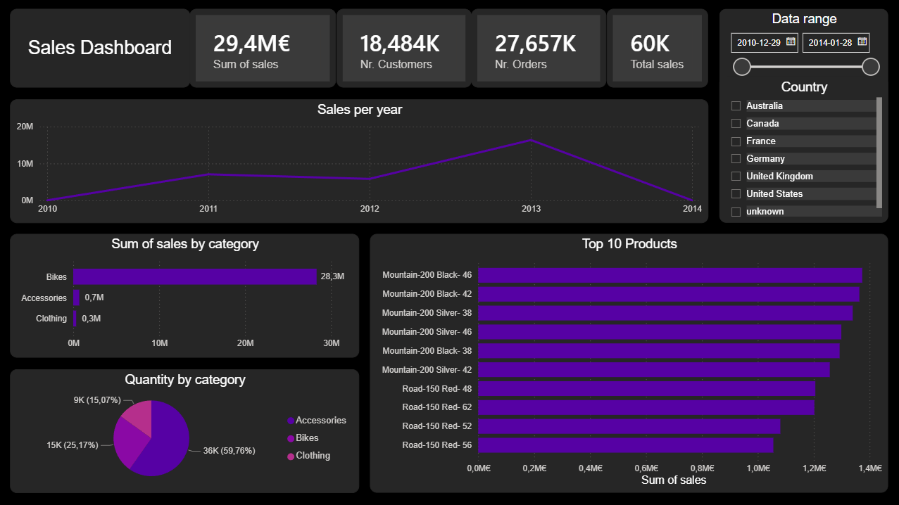
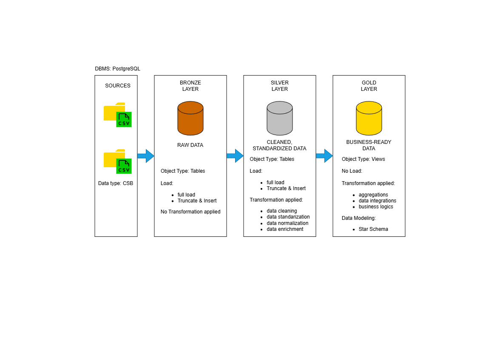

# SQL Data Warehouse + EDA + Power BI Sales Dashboard

Project that demonstrates an end-to-end analytics workflow: building a small **SQL data warehouse** (bronze/silver/gold layers), modeling a **star schema**, performing **EDA**, and delivering a **Power BI** dashboard for sales monitoring.

---

## Overview

**Goal:** create a clean analytics-ready model (Gold layer) and a simple **Sales Overview** dashboard that answers questions like:
- How much revenue did we generate?
- How many **unique orders** and customers do we have?
- How does sales change over time?
- Which categories/products drive the most sales?

**Deliverables included in this repo:**
- SQL scripts for a 3-layer warehouse (bronze → silver → gold)
   - DBMS -> PostgreSQL
- A star schema in the Gold layer (`fact_sales` + dimensions)
- EDA SQL queries (basic + advanced)
- Power BI report (`.pbix`) built on top of the Gold layer (imported)

---

## Dashboard Preview

<p align="center">
  
</p>

**What’s included on the dashboard (1 page – Sales Overview):**
- KPI cards: Total Sales, Nr. Customers, Nr. Orders, Total Quantity
- Trend: Sales per year
- Breakdown: Sales by category
- Top 10 products by sales
- Slicers: date range + country

---


## High-Level Architecture

This project follows a **Medallion / Layered** approach:

- **Bronze**: raw ingested data (as-is)
- **Silver**: cleaned and standardized data
- **Gold**: business-ready model for analytics (star schema)

Gold is the layer consumed by **Power BI** for reporting.

<p align="center">
  
</p>

---

## Dataset and Model

### Data source
- **Source format:** CSV files
- **Loaded into:** SQL data warehouse (bronze → silver → gold)

### Data
- **`source_crm`**: data coming from a CRM-like system (customer-related and sales-related entities)
- **`source_erp`**: data coming from an ERP-like system (product/business master data, operational attributes)

### Gold layer (star schema)
**Fact table**
- `gold.fact_sales`
- **Grain (granularity):** *one row represents one sales line / transaction line* (that’s why one `order_number` can appear in multiple rows — one order can contain multiple products)

**Dimensions**
- `gold.dim_customers`
- `gold.dim_products`

**Relationships (typical star schema)**
- `gold.fact_sales[customer_key]` -> `gold.dim_customers[customer_key]`
- `gold.fact_sales[product_key]` -> `gold.dim_products[product_key]`

> If you keep the model as above, all filters from dimensions (e.g., country, category) correctly filter the fact table in Power BI.

### Date range
- **2010-12-29 -> 2014-01-28**

---

## KPIs (report aggregations)

KPI values are calculated directly in visuals using Power BI’s built-in summarization

### Repository structure

```text

sql-data-warehouse-eda-project/
├─ bi/
│  └─ *.pbix
├─ dataset/
│  ├─ source_crm/
│  └─ source_erp/
├─ docs/
│  ├─ dashboard_overview.png
│  └─ data_architecture.png
├─ eda/
│  ├─ 01_eda_basic.sql
│  └─ 02_eda_advanced.sql
├─ reports/
│  ├─ gold_view_custimers.sql
│  └─ gold_view_products.sql
├─ scripts/
│  ├─ bronze/                                  # raw data
│  ├─ silver/                                  # cleaned/standardized data 
│  ├─ gold/                                    # business ready
│  └─ 00init_database.sql                      # database init  
├─ test/
│  ├─ foreign_key_integration.sql
│  └─ quality_checks_silver.sql
├─ LICENSE
└─ README.md

```
## License

This project is licensed under the **MIT License**.  
See [LICENSE](LICENSE) for details.
